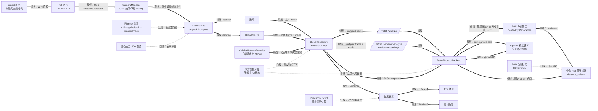

# OmniEye 开发看板

更新时间：2026-05-27

## 当前中心任务

把真实 X4 低频帧闭环打通并稳定下来：

```text
X4 拍照/取帧 -> Android bitmap -> 蜂窝网络上传云端 -> /analyze 或 /semantic-analyze -> TTS/震动反馈
```

当前优先级不是路演脚本，而是真实设备链路。路演固定脚本保留为保底，不作为真实性能或真实识别结果。

## 分支与位置

当前开发工作区：

```text
C:\Users\EZ\.config\superpowers\worktrees\OmniEye-Mobile-roadshow\feature-x4-real-frame-loop
local branch: feature/x4-real-frame-loop-2
remote branch: android-insta360/feature/x4-real-frame-loop
```

GitHub 仓库：

```text
https://github.com/prophetricker/Android-app-for-Insta360-X4-integration
```

说明：本地分支名带 `-2` 是因为本机曾存在同名临时分支；推送目标仍是远端 `feature/x4-real-frame-loop`。不要直接推 `main`，后续通过 PR 合入。

队友性能分支任务文档：

```text
docs/perf/teammate-agent-task.md
docs/perf/latency-baseline.md
```

## 当前状态

- [x] GitHub `main` 已包含 `cloud-backend/`、Android 云端接口、X4 OSC 基础链路和语义分析接口。
- [x] App 主功能收敛为 `避障` 和 `查看周围环境`。
- [x] X4 WiFi 可以连接，App 可识别 `192.168.42.1` 上的 Insta360 X4。
- [x] 手机连接 X4 WiFi 时，云端 OkHttp 可绑定蜂窝网络，不绑定整个进程。
- [x] `/health` 已改为蜂窝绑定，避免检测云端时误走 X4 WiFi。
- [x] X4 拍照状态轮询已改用 `/osc/commands/status`，避免轮询时反复触发 `camera.takePicture`。
- [x] `/analyze` 返回 `distance_m`、`level`、`confidence`、`scene_text`、`latency_ms`。
- [x] `/semantic-analyze mode=surroundings` 用于全景查看周围环境。
- [ ] 连续 5 次真实 X4：拍照 -> 下载 bitmap -> 上传 -> 返回 -> 播报，还需要实机验收。
- [ ] 端到端耗时需要记录并拆分到 X4 拍照、下载、压缩、上传、后端、TTS。

## 架构图

颜色说明：

- 绿线：已完成或已跑通
- 黄线：正在攻克
- 白线：计划中
- 红线：废弃或只保留为保底



## 待办事项

P0：真实 X4 闭环

- [x] 修复 X4 状态轮询错误：`execute` 只发一次，后续用 `status` 查进度。
- [x] 修复 `/health` 未走蜂窝的问题。
- [x] 验证手机连 X4 WiFi 时，App 的 `/health` 能经蜂窝到 ngrok 并返回 200。
- [ ] 点击一次 `避障`，确认只触发一次 `camera.takePicture`，后续只轮询 `status`。
- [ ] 确认 `/analyze` 出现在 ngrok 请求列表，App 收到结果并播报。
- [ ] 点击一次 `查看周围环境`，确认 `/semantic-analyze` 返回可播报中文描述。
- [ ] 连续 5 次实机闭环，记录成功率和耗时。

P1：性能与稳定性

- [ ] 增加 X4 拍照、下载、压缩、上传、后端返回、TTS 启动的耗时日志。
- [ ] 根据日志判断瓶颈：X4 拍照/下载、上传图片大小、DAP 推理、OpenAI 语义分析。
- [ ] 接收队友 `feature/perf-telemetry-upload-fastpath` PR，合入上传压缩和埋点。
- [ ] 将目标口径固定为“按按钮到开始播报约 2 秒”。

P2：距离可信度

- [ ] 收集 10-20 张 X4 实拍样张，记录真实障碍距离。
- [ ] 对比中心 ROI 与更适合行走避障的 ROI。
- [ ] 调整 `DAP_DEPTH_SCALE` 和风险等级阈值。
- [ ] 输出 debug overlay，确认距离统计区域选对。

P3：Git 安全

- [ ] 每次提交前扫描：SDK、DAP 权重、`.env`、大图片、视频、PDF 不进 Git。
- [ ] 影石 SDK 只本机引用或按合法方式配置，不上传 SDK 内容。
- [ ] DAP 仓库和权重继续放外部目录，例如 `D:\Models\DAP`。

## 常用命令

后端启动：

```powershell
cd C:\Users\EZ\.config\superpowers\worktrees\OmniEye-Mobile-roadshow\feature-x4-real-frame-loop
& 'D:\MyProject\Bohack2\.tooling\python312\python.exe' -m uvicorn omnieye_cloud.main:app --app-dir cloud-backend --host 0.0.0.0 --port 8000
```

后端健康检查：

```powershell
curl.exe http://127.0.0.1:8000/health
curl.exe -H "ngrok-skip-browser-warning: true" https://swaddling-onslaught-crane.ngrok-free.dev/health
```

Android 构建：

```powershell
cd C:\Users\EZ\.config\superpowers\worktrees\OmniEye-Mobile-roadshow\feature-x4-real-frame-loop
$env:JAVA_HOME='D:\MyProject\Bohack2\.tooling\jdk17\jdk-17.0.19+10'
$env:ANDROID_HOME='D:\MyProject\Bohack2\.tooling\android-sdk'
$env:ANDROID_SDK_ROOT=$env:ANDROID_HOME
& 'C:\Users\EZ\.gradle\wrapper\dists\gradle-8.11.1-bin\7800bkpvjdl6wgx6vnys98319\gradle-8.11.1\bin\gradle.bat' testDebugUnitTest assembleDebug -PCLOUD_BASE_URL="https://swaddling-onslaught-crane.ngrok-free.dev/" --no-daemon
```

安装 APK：

```powershell
& 'D:\MyProject\Bohack2\.tooling\android-sdk\platform-tools\adb.exe' install -r app\build\outputs\apk\debug\app-debug.apk
```

抓日志：

```powershell
& 'D:\MyProject\Bohack2\.tooling\android-sdk\platform-tools\adb.exe' logcat -c
& 'D:\MyProject\Bohack2\.tooling\android-sdk\platform-tools\adb.exe' logcat CameraManager:V CloudRepository:V CellularNetworkProvider:V OkHttp:V TextToSpeechManager:V AndroidRuntime:E System.err:W '*:S'
```

安全扫描：

```powershell
git ls-files | rg -n "(?i)(\.aar$|\.so$|\.rar$|\.zip$|\.pth$|\.onnx$|\.safetensors$|weights|model\.pth|SDK|DAP-weights|\.env$|\.mp4$|\.pdf$)"
```
