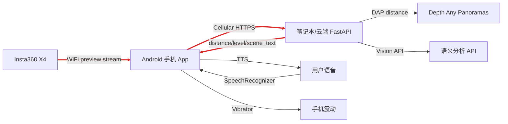

# OMNIEYE Mobile 看板

更新时间：2026-05-23

## 当前任务中心

手机中心 MVP：

```text
X4 WiFi 取预览帧 -> Android 低频抽帧 -> 蜂窝网络上传 -> 笔记本/云端推理 -> 手机震动/语音反馈
```

当前优先级：

1. 提交并推送 mobile-first 工程骨架到 `https://github.com/prophetricker/OMNIEYE-Mobile`。
2. 在本机补齐 JDK 17 / Android SDK 环境后跑通 Android 单测。
3. 在 Android 端把蜂窝网络绑定层接到实际后端 HTTP 客户端。
4. 接入影石 Android SDK 的 WiFi 连接和预览帧。
5. 把 mock 结果接到手机震动和 TTS。

## 架构图



红色链路表示当前重构主线。

## 已确认事实

- 本地已解压影石 Android/iOS SDK 包到 `.sdk_extract/mobile/sdk_demo_1.9.11/sdkdemo2`。
- SDK demo 使用 `com.arashivision.sdk:sdkcamera:1.9.11` 和 `com.arashivision.sdk:sdkmedia:1.9.11`。
- SDK demo 的 WiFi 连接入口参考 `ConnectViewModel.connectDeviceByWiFi()`。
- SDK demo 的预览流入口参考 `CaptureViewModel.openPreviewStream()`。
- SDK demo 在相机 HTTP 操作时会临时 `bindProcessToNetwork(cameraNet)`，本项目云端 HTTP 不能全局绑定进程，应只绑定云端客户端到蜂窝网络。

## 待办

### P0: 工程和后端 mock

- [x] 新建 Android Kotlin 工程骨架。
- [x] 新建 `mobile-backend` FastAPI mock 服务。
- [x] 定义 `/analyze` 请求/响应结构。
- [x] Android 端实现 `AnalyzeResponse` 数据模型和危险等级震动映射。
- [x] 将影石 Maven 凭据改为从 `local.properties` 或环境变量读取，避免提交本地凭据。

### P1: 双网络验证

- Android 请求 `TRANSPORT_CELLULAR + NET_CAPABILITY_INTERNET`。
- 后端 HTTP 客户端只使用蜂窝 `Network`。
- 手机 WiFi 连 X4 时，仍能访问公网隧道 `/health`。

### P2: X4 取流

- 接入影石 Android SDK Maven 配置。
- 复用 SDK demo 的 WiFi 连接流程。
- 启动 X4 预览流。
- 低频抽帧为 JPEG。

### P3: 交互闭环

- `/analyze` 返回 `distance_m`、`level`、`confidence`、`scene_text`、`latency_ms`。
- `level >= 2` 触发手机震动。
- 语音询问距离/场景时，播放最近一次结果。

## 风险

- 本机当前未发现全局 `gradle`、`java`、`adb` 命令；Android 构建可能依赖 Android Studio/Gradle wrapper 自带环境。
- 已加入 Gradle wrapper；当前 Android 测试阻塞在 `JAVA_HOME` 未设置且 `java.exe` 不在 `PATH`。
- 后端 mock 已通过 `python -m pytest mobile-backend`，共 3 个测试。
- `2026-05-23` 最新验证：`python -m pytest mobile-backend` 通过 3 项；`.\gradlew.bat testDebugUnitTest` 因本机未配置 Java 失败。
- 手机必须有蜂窝数据；没有 SIM 时双网络方案无法完整验证。
- 公网隧道 URL 需要现场选择 ngrok、Cloudflare Tunnel 或 Tailscale。
