# OmniEye 开发看板

更新时间：2026-05-28

## 当前中心任务

第一版真实功能目标已经收窄：不完整复刻影石 Demo，而是先把 `避障` 从“OSC 完整拍照/下载，可能 60 秒”改成“影石 SDK 预览流取帧”。

目标链路：

```text
X4 WiFi 连接 -> Insta360 SDK 预览流 -> Android 获取最新 preview bitmap
-> 点击避障直接上传 preview bitmap -> 云端 /analyze -> TTS/震动
```

完整拍照链路暂时保留为兜底，不作为避障主路径。

## 当前仓库与分支

主开发工作区：

```text
C:\Users\EZ\.config\superpowers\worktrees\OmniEye-Mobile-roadshow\feature-x4-real-frame-loop
local branch: feature/x4-real-frame-loop-2
target remote branch: feature/x4-real-frame-loop
remote: android-insta360=https://github.com/prophetricker/Android-app-for-Insta360-X4-integration.git
```

项目资源根目录：

```text
D:\MyProject\Bohack2
```

注意：

- `D:\MyProject\Bohack2` 不是 Git 仓库，主要放 SDK、DAP、工具、看板和展示资料。
- 影石 SDK 包、DAP 权重、`.env`、APK 构建产物不提交到 Git。
- SDK 通过 Maven 依赖接入，凭证通过环境变量或 Gradle property 传入，不写进仓库。

## 当前状态

Android：

- [x] 默认不开 SDK 的 `assembleDebug` 通过。
- [x] 启用 SDK 的 `assembleDebug -PINSTA360_SDK_ENABLED=true` 通过。
- [x] 已安装 SDK 版 APK 到 OnePlus 9 Pro，包内 `minSdk=28`、`versionName=1.0.0`。
- [x] `避障` 的取帧策略已改为优先使用 SDK 预览帧。
- [x] 没有 SDK 预览帧时，仍 fallback 到最近 X4 拍照帧、完整拍照、开发样张。
- [x] 已新增 `SdkPreviewFrameHost`，通过反射接入 SDK，默认不开 SDK 时不强依赖 SDK 类。
- [x] SDK 预览流流程已调整为接近官方 Demo：`startPreviewStream -> player prepare/play -> onLoadingFinish attach pipeline -> startExtractMediaFrame`。
- [x] 已增加关键日志：SDK 初始化、WiFi network 选择、preview stream opened、player loading finished、pipeline attached、preview frame received。
- [ ] 真机连 X4 WiFi 后确认能持续收到 `SDK preview frame received` 日志。
- [ ] 点击 `避障` 后确认日志走 `usingSdkPreviewFrameMs`，不再走 `enteringTakePhotoMs`。
- [ ] 连续 5 次真实 X4 SDK 预览帧上传 -> 云端返回 -> 播报/震动稳定验收。

云端：

- [x] FastAPI `GET /health`。
- [x] FastAPI `POST /analyze`，multipart 字段为 `frame`。
- [x] FastAPI `POST /semantic-analyze`，支持 `mode=product/traffic_light/surroundings`。
- [x] DAP 未就绪时 `/analyze` 返回兼容 fallback，App 不崩。
- [x] 第三方 OpenAI 中转视觉语义可用于 `查看周围环境`。
- [ ] DAP 常驻 worker、真实距离标定、ROI overlay 仍未完成。

Git 安全：

- [x] 当前 Git 跟踪文件扫描未命中 `.aar/.so/.zip/.pth/.onnx/.safetensors/weights/.env/SDK包/DAP-weights`。
- [ ] 每次提交前继续跑安全扫描。


展示版补充：

- [x] 已用 `C:\Users\EZ\Desktop\IMG_20260528_103338_00_054.insp` 直接上传 `/semantic-analyze mode=surroundings` 验证；`.insp` 是 JPEG 容器，后端可直接识别。
- [x] 该图用于路演时按“佩戴者面向台下”解释：前方是观众席和评委区，中间有白色座椅和开阔通道，左右两侧是展位和设备区域，身后是蓝色世界智能产业博览会主背景板。
- [x] 当前视觉语义云端耗时约 55 秒，不适合现场按键后等待，所以展示版加入“双击音量下键”预置播报：第一次提示“正在识别指令”，第二次提示“分析指令中”并播报该全景图结果。
- [x] 样张文件不提交 Git，只提交展示状态机和播报文案。
## 架构图

颜色说明：

- 绿色线：已实现或已验证。
- 黄色线：正在攻克。
- 白色线：计划中。
- 红色线：废弃或保底，不作为真实主路径。

```mermaid
flowchart LR
    X4[Insta360 X4<br/>头戴式全景相机]
    Wifi[X4 WiFi<br/>192.168.42.1 局域网]
    SDK[Insta360 SDK<br/>Preview Stream]
    Preview[SDK 预览帧<br/>960x480 RGBA bitmap]
    Android[Android App<br/>Jetpack Compose]
    Avoidance[避障]
    Surroundings[查看周围环境]
    OSC[OSC 完整拍照/下载]
    CloudRepo[CloudRepository<br/>Retrofit/OkHttp]
    Cellular[CellularNetworkProvider<br/>云端请求走 4G/5G]
    Analyze[/POST /analyze/]
    Semantic[/POST /semantic-analyze<br/>mode=surroundings/]
    Backend[FastAPI cloud-backend]
    DAP[DAP<br/>Depth Any Panoramas]
    ROI[中心 ROI 深度统计<br/>distance_m/level]
    Vision[视觉语义模型<br/>全景环境理解]
    UI[App 结果展示]
    TTS[TTS 播报]
    Haptic[震动反馈]
    Demo[Roadshow Script<br/>固定演示结果]
    Mock[旧 mock 流程<br/>/v1/image/upload -> processImage]
    Perf[性能分支<br/>压缩/上传/日志]
    Calibration[DAP 距离标定<br/>ROI overlay]

    X4 ==>|绿色：手机连接 X4 WiFi| Wifi
    Wifi ==>|黄色：真机预览流验证中| SDK
    SDK ==>|黄色：startExtractMediaFrame| Preview
    Preview ==>|黄色：latestPreviewBitmap| Android
    Android ==>|绿色：点击避障| Avoidance
    Avoidance ==>|黄色：优先上传 SDK 预览帧| CloudRepo
    Android ==>|绿色：查看周围环境| Surroundings
    Surroundings ==>|绿色：上传全景图| CloudRepo
    Cellular ==>|绿色：仅云端请求绑定蜂窝| CloudRepo
    CloudRepo ==>|绿色：multipart frame| Analyze
    CloudRepo ==>|绿色：multipart frame + mode| Semantic
    Analyze ==>|绿色| Backend
    Semantic ==>|绿色| Backend
    Backend ==>|白色：常驻推理/标定待做| DAP
    DAP ==>|白色：depth map| ROI
    ROI ==>|绿色：JSON 合同| Backend
    Backend ==>|绿色：JSON| CloudRepo
    Backend ==>|绿色：summary/objects| Vision
    Vision ==>|绿色：语义 JSON| Backend
    CloudRepo ==>|绿色：response| UI
    UI ==>|绿色：scene_text/summary| TTS
    UI ==>|绿色：level>=2| Haptic
    OSC -.->|红色：仅兜底，避障不应主走| Android
    Demo -.->|红色：仅保底演示| UI
    Mock -.->|红色：废弃| Android
    Perf -.->|白色：后续低冲突优化| CloudRepo
    Calibration -.->|白色：样本标定| ROI
```



## 下一步你需要做什么

P0：验证 SDK 预览帧是否真的到 App

- [ ] 把 OnePlus 9 Pro 连接到 X4 WiFi。
- [ ] 如果系统提示“此 WiFi 无互联网，是否保持连接”，选择保持连接。
- [ ] 打开 OmniEye，点“连接相机”。
- [ ] 保持手机 USB 连接电脑，我这边抓日志。
- [ ] 期望日志出现：

```text
SdkPreviewFrameHost: Starting SDK preview frame host
SdkPreviewFrameHost: SDK preview stream opened
SdkPreviewFrameHost: SDK capture player loading finished
SdkPreviewFrameHost: SDK camera pipeline attached
SdkPreviewFrameHost: SDK preview frame received count=1 size=960x480
```

P0：验证避障是否走预览帧

- [ ] 上面日志出现后，点击 `避障`。
- [ ] 期望日志出现：

```text
MainViewModel: ObstacleClickTiming usingSdkPreviewFrameMs=...
```

- [ ] 如果仍出现 `enteringTakePhotoMs=...`，说明 preview bitmap 没有进入 `CameraManager.lastPreviewBitmap`，继续查 SDK 抽帧。

P1：端到端耗时

- [ ] 连续点击 5 次 `避障`，记录每次从点击到播报的耗时。
- [ ] 如果取帧已变快但总耗时仍长，下一步优先看上传压缩和云端 DAP/语义模型耗时。

## 常用命令

Android 默认验证：

```powershell
cd C:\Users\EZ\.config\superpowers\worktrees\OmniEye-Mobile-roadshow\feature-x4-real-frame-loop
$env:JAVA_HOME='D:\MyProject\Bohack2\.tooling\jdk17\jdk-17.0.19+10'
$env:ANDROID_HOME='D:\MyProject\Bohack2\.tooling\android-sdk'
$env:ANDROID_SDK_ROOT=$env:ANDROID_HOME
& 'C:\Users\EZ\.gradle\wrapper\dists\gradle-8.11.1-bin\7800bkpvjdl6wgx6vnys98319\gradle-8.11.1\bin\gradle.bat' testDebugUnitTest assembleDebug --no-daemon --no-build-cache
```

Android SDK 版构建：

```powershell
cd C:\Users\EZ\.config\superpowers\worktrees\OmniEye-Mobile-roadshow\feature-x4-real-frame-loop
$env:JAVA_HOME='D:\MyProject\Bohack2\.tooling\jdk17\jdk-17.0.19+10'
$env:ANDROID_HOME='D:\MyProject\Bohack2\.tooling\android-sdk'
$env:ANDROID_SDK_ROOT=$env:ANDROID_HOME
$env:INSTA360_MAVEN_USER='insta360guest'
$env:INSTA360_MAVEN_PASSWORD='<本机环境变量里设置，不写进 Git>'
& 'C:\Users\EZ\.gradle\wrapper\dists\gradle-8.11.1-bin\7800bkpvjdl6wgx6vnys98319\gradle-8.11.1\bin\gradle.bat' assembleDebug -PINSTA360_SDK_ENABLED=true --no-daemon --no-build-cache
```

安装 APK：

```powershell
cd C:\Users\EZ\.config\superpowers\worktrees\OmniEye-Mobile-roadshow\feature-x4-real-frame-loop
& 'D:\MyProject\Bohack2\.tooling\android-sdk\platform-tools\adb.exe' install -r 'app\build\outputs\apk\debug\app-debug.apk'
```

抓关键日志：

```powershell
& 'D:\MyProject\Bohack2\.tooling\android-sdk\platform-tools\adb.exe' logcat -c
& 'D:\MyProject\Bohack2\.tooling\android-sdk\platform-tools\adb.exe' logcat -s SdkPreviewFrameHost CameraManager MainViewModel AndroidRuntime
```

启动后端：

```powershell
cd C:\Users\EZ\.config\superpowers\worktrees\OmniEye-Mobile-roadshow\feature-x4-real-frame-loop
$env:DAP_REPO_DIR = "D:\Models\DAP"
$env:DAP_WEIGHTS_PATH = "D:\Models\DAP-weights-repo\model.pth"
$env:DAP_DEVICE = "cuda"
$env:DAP_PYTHON = "D:\MyProject\Bohack2\.tooling\dap-venv\Scripts\python.exe"
$env:DAP_DEPTH_SCALE = "100"
& 'D:\MyProject\Bohack2\.tooling\python312\python.exe' -m uvicorn omnieye_cloud.main:app --app-dir cloud-backend --host 0.0.0.0 --port 8000
```

安全扫描：

```powershell
git ls-files | rg -n "(?i)(\.aar$|\.so$|\.rar$|\.zip$|\.pth$|\.onnx$|\.safetensors$|weights|model\.pth|赛事SDK|SDK包|DAP-weights|\.env$)"
```
