# OmniEye 开发看板

更新时间：2026-05-27 16:52

## 当前中心任务

把真实 X4 低频帧闭环稳定下来，并把端到端耗时降到可演示、可继续优化的状态：

```text
X4 拍照/取帧 -> Android bitmap -> 蜂窝网络上传云端 -> /analyze 或 /semantic-analyze -> TTS/震动反馈
```

当前实测结论：

- X4 已能连接，App 可以通过 OSC 触发拍照、下载 bitmap 并上传云端。
- `查看周围环境` 已能用 Qwen 视觉模型返回真实全景语义描述，但速度偏慢。
- X4 WiFi 当前不稳定，可能与设备过热有关；短期开发以 App 内开发样张、后端 `cloud-backend/uploads/latest.jpg` 和 App 内最近一次 X4 bitmap 继续测试。
- `避障` 之前只返回固定 fallback：`正在分析前方环境`。原因是 DAP 尚未配置，`/analyze` 没有真实深度结果。
- 现在 `/analyze` 增加了真实视觉避障兜底：DAP 未产出时，裁剪前方中心区域，调用视觉模型返回 `distance_m/level/confidence/scene_text`。
- 新 `/analyze` 不再阻塞整个 FastAPI 事件循环；慢模型调用期间 `/health` 仍能快速返回。
- 当前视觉兜底耗时仍约 10-13 秒，不满足 2 秒避障目标。2 秒目标后续必须靠 DAP 常驻化、相机取帧方式优化、上传压缩和本地/边缘推理。
- 路演专用音量下键循环假结果已删除；实体音量键不再触发 App 逻辑，App 内麦克风按钮已接回真实系统语音识别。
- 商品识别、红绿灯识别的语音意图不再返回固定路演脚本，改为走 `/semantic-analyze`；无 X4 最近帧时使用开发样张。
- 2026-05-27 16:30 左右 ADB 证据显示：当前手机系统没有可用 `android.speech.RecognitionService`，`SpeechRecognizer.isRecognitionAvailable()` 返回不可用是合理结果，不是麦克风权限或过热直接导致。后续要么启用/安装系统识别服务，要么改做云端录音识别。
- 2026-05-27 16:34 左右 ADB 证据显示：`wlan0` 为 `NO-CARRIER/state DOWN`，没有 `192.168.42.x` 地址，`ping 192.168.42.1` 失败。也就是说抓日志时系统层没有连上 X4 WiFi，真机联调前要先确认系统路由。
- 本轮新增性能可观测性：Android 会打印 `UploadPrepare`、`AnalyzeFrameTiming`、`SemanticAnalyzeTiming`；后端会打印 `analyze_received/analyze_timing/semantic_received/semantic_timing`。
- 本轮新增上传快路径：`避障` 上传长边 960、JPEG 质量 72；`查看周围环境` 上传长边 1280、JPEG 质量 78；旧通用上传保留长边 1920、质量 85。
- X4 拍照返回后不再为了保存到相册阻塞分析链路，避免 5888x2944 全景图以高质量压缩保存拖慢“按按钮到上传”。
- 当前 Android 相机链路不是影石官方 SDK，而是 X4 OSC/local HTTP：`/osc/info`、`/osc/state`、`/osc/commands/execute`、`/osc/commands/status`、文件 URL 下载。GitHub `main` 当前也没有影石 SDK 依赖。
- 2026-05-27 16:45 左右 ADB 证据显示：X4 WiFi 已稳定到系统路由层，手机 `wlan0=192.168.42.6/24`，`ping 192.168.42.1` 成功约 3ms。
- 本轮继续新增相机耗时日志：`ObstacleClickTiming`、`SurroundingsClickTiming`、`TakePhotoTiming`、`CaptureTiming`、`ProcessPhotoTiming`，用于定位“点击后到开始拍摄约 10 秒”到底卡在哪。
- `查看周围环境` 的后端提示词已强化为全景叙述：要求覆盖前方、后方、左侧、右侧、头顶、脚下，不再只描述正前方。

## 分支与位置

当前开发工作区：

```text
C:\Users\EZ\.config\superpowers\worktrees\OmniEye-Mobile-roadshow\feature-x4-real-frame-loop
local branch: feature/x4-real-frame-loop-2
remote target: android-insta360/feature/x4-real-frame-loop
```

GitHub 仓库：

```text
https://github.com/prophetricker/Android-app-for-Insta360-X4-integration
```

说明：本地分支名带 `-2` 是本机 worktree 遗留命名；推送目标仍是远端 `feature/x4-real-frame-loop`。不要直接推 `main`，后续通过 PR 合入。

队友性能分支暂不合入：

```text
feature/perf-telemetry-upload-fastpath
```

原因：该分支 diff 过大，删除/替换了当前后端和蜂窝路由等关键结构，只保留压缩规格、埋点思路供后续参考。

## 架构图

颜色说明：

- 绿线：已完成或已跑通
- 黄线：正在攻克
- 白线：计划中
- 红线：废弃或只保留为保底

```mermaid
flowchart LR
    X4[Insta360 X4<br/>头戴式全景相机]
    Wifi[X4 WiFi<br/>192.168.42.1]
    Android[Android App<br/>Jetpack Compose]
    Camera[CameraManager<br/>OSC 拍照/下载 bitmap]
    Cellular[CellularNetworkProvider<br/>云端请求走 4G/5G]
    CloudRepo[CloudRepository<br/>Retrofit/OkHttp]
    Avoidance[避障]
    Surroundings[查看周围环境]
    Analyze[/POST /analyze/]
    Semantic[/POST /semantic-analyze<br/>mode=surroundings/]
    Backend[FastAPI cloud-backend]
    DAP[DAP 外部模型<br/>Depth Any Panoramas]
    ROI[中心 ROI 深度统计<br/>distance_m/level]
    ObstacleVision[视觉避障兜底<br/>前方中心裁剪]
    Vision[OpenAI/Qwen 视觉语义<br/>全景环境理解]
    UI[结果显示]
    TTS[TTS 播报]
    Haptic[震动反馈]
    Demo[Roadshow Script<br/>固定演示结果]
    Voice[真实语音输入<br/>系统 SpeechRecognizer]
    Mock[旧 mock 流程<br/>/v1/image/upload -> processImage]
    Perf[性能优化<br/>压缩/埋点/常驻推理]
    SDK[影石官方 SDK 集成]
    Calibration[DAP 距离标定<br/>ROI overlay]

    X4 ==>|绿线：WiFi 连接| Wifi
    Wifi ==>|绿线：OSC info/execute/status| Camera
    Camera ==>|黄线：拍照耗时仍偏长| Android
    Android ==>|绿线：bitmap| Avoidance
    Android ==>|绿线：bitmap| Surroundings
    Avoidance ==>|绿线：上传 frame| CloudRepo
    Surroundings ==>|绿线：上传 frame + mode| CloudRepo
    Cellular ==>|绿线：仅云端请求绑定蜂窝| CloudRepo
    CloudRepo ==>|绿线：multipart frame| Analyze
    CloudRepo ==>|绿线：multipart frame + mode| Semantic
    Analyze ==>|绿线| Backend
    Semantic ==>|绿线| Backend
    Backend ==>|白线：真实深度主路径待配置| DAP
    DAP ==>|白线：depth map| ROI
    ROI ==>|白线：距离等级| Backend
    Backend ==>|黄线：DAP 未就绪时可用但慢| ObstacleVision
    ObstacleVision ==>|绿线：兼容 AnalyzeResponse| Backend
    Backend ==>|绿线：真实全景语义| Vision
    Vision ==>|黄线：速度优化| Backend
    Backend ==>|绿线：JSON response| CloudRepo
    CloudRepo ==>|绿线：显示结果| UI
    UI ==>|绿线：中文文本| TTS
    UI ==>|绿线：level >= 2| Haptic
    Voice ==>|黄线：识别稳定性待实机验证| Android
    Demo -.->|红线：已从主线删除| UI
    Mock -.->|红线：废弃主路径| Android
    Perf -.->|白线：后续重做为小 PR| CloudRepo
    Perf -.->|白线：后端耗时日志| Backend
    SDK -.->|白线：当前未使用，后续评估| Android
    Calibration -.->|白线：样本标定| ROI
```



## 当前状态

- [x] GitHub `main` 已包含 `cloud-backend/`、Android 云端接口、X4 OSC 基础链路和语义分析接口。
- [x] App 主功能已收敛为 `避障` 和 `查看周围环境`。
- [x] X4 WiFi 可以连接，App 能识别 `192.168.42.1` 上的 Insta360 X4。
- [x] 云端 OkHttp 请求可绑定蜂窝网络，不绑定整个进程。
- [x] `/health` 已走蜂窝绑定，避免检测云端时误走 X4 WiFi。
- [x] X4 拍照状态轮询已改为 `/osc/commands/status`，避免轮询时重复触发 `camera.takePicture`。
- [x] 相机 HTTP 请求已改为绑定 X4 WiFi Network，避免系统默认网络切到蜂窝后访问不了 `192.168.42.1`。
- [x] UI 不再伪造“X4 已连接”，相机状态显示真实连接状态。
- [x] `云端已连接` 文案改为 `后端在线`，避免误导为整条链路完全可用。
- [x] 后端已保存真实 X4 全景图，证明拍照、下载、上传链路打通。
- [x] `/semantic-analyze mode=surroundings` 可以返回真实中文环境描述。
- [x] `/analyze` 在 DAP 未就绪时已增加视觉避障兜底，不再只播报“正在分析前方环境”。
- [x] 慢视觉模型调用已移入线程池，不阻塞 `/health`。
- [x] 删除路演音量下键假流程：`KEYCODE_VOLUME_DOWN` 不再被 App 拦截。
- [x] 删除路演固定结果脚本和 `RoadshowSynthetic` 数据源。
- [x] 语音按钮恢复真实 `SpeechRecognizer`，识别结果通过 `routeVoiceCommand()` 分发到避障/周围环境/商品/红绿灯。
- [x] X4 断开后不清空最近一次 bitmap，方便 WiFi 不稳定时继续用上一张全景图测试。
- [x] 避障上传已改为 960px 快路径；周围环境上传已改为 1280px 中等规格。
- [x] 分析链路不再等待 X4 图片保存到相册。
- [x] Android 和后端已增加本轮性能日志，下一次真机点击后可拆分定位慢点。
- [x] 当前 OnePlus9Pro 系统无 `RecognitionService`，麦克风按钮显示“语音识别不可用”属于系统能力缺失。
- [x] 重新连接 X4 WiFi 后确认 `wlan0` 有 `192.168.42.x`，并且 `ping 192.168.42.1` 成功。
- [x] `查看周围环境` 提示词已要求覆盖前后左右、头顶和脚下。
- [x] 已确认当前不是官方 SDK 路径，而是 OSC/local HTTP 路径。
- [ ] 连续 5 次真实 X4：拍照 -> 下载 bitmap -> 上传 -> 返回 -> 播报，还需要实机验收。
- [ ] 端到端耗时需要拆分到 X4 拍照、下载、压缩、上传、后端、TTS。

## 待办事项

P0：真实 X4 闭环

- [x] 修复 X4 状态轮询错误：`execute` 只发一次，后续用 `status` 查进度。
- [x] 修复 `/health` 未走蜂窝的问题。
- [x] 修复相机请求误走蜂窝导致无法访问 `192.168.42.1` 的问题。
- [x] 验证后端确实收到真实 X4 全景图。
- [x] 修复 `/analyze` 只返回 fallback 的问题：DAP 未就绪时走视觉避障兜底。
- [ ] 真机连续确认 `避障` 能稳定返回真实风险文案并触发 TTS/震动，不再只返回 fallback。
- [ ] 连续点击 `避障` 5 次，记录 X4 拍照耗时、后端耗时、总耗时。
- [ ] 连续点击 `查看周围环境` 3 次，记录成功率和耗时。
- [ ] 如果 X4 拍照仍约 10-15 秒，优先根据 `ObstacleClickTiming/TakePhotoTiming/CaptureTiming` 排查慢在点击到协程、X4 WiFi route、`/osc/state`、`camera.takePicture`、status 轮询还是图片下载。
- [ ] 评估影石官方 SDK 是否能拿到更低延迟的预览帧/视频帧；如果可以，替换当前 OSC 拍照作为实时避障取帧路径。
- [ ] X4 WiFi 不稳定期间，优先用 App 内最近一次 bitmap 或开发样张测试 `/analyze`、`/semantic-analyze`。

P1：性能与稳定性

- [x] 后端视觉调用线程池化，避免慢请求阻塞 `/health`。
- [x] 避障视觉输入改为前方中心裁剪 + 640px JPEG，减少模型输入量。
- [x] Android 增加上传压缩、请求往返、后端返回耗时日志。
- [x] 后端增加每次图片字节数、宽高、保存耗时、模型耗时、总耗时日志。
- [x] Android 已补齐点击到相机、相机路由、状态查询、takePicture、轮询、下载的细粒度耗时日志。
- [ ] Android 继续补齐 TTS 启动耗时日志。
- [ ] 重做性能 PR：只引入压缩规格和埋点，不合入队友当前大 diff 分支。
- [ ] 将目标口径固定为“按按钮到开始播报约 2 秒”。

P1：语音输入

- [x] 删除音量下键演示流程。
- [x] App 内麦克风按钮接回真实语音识别。
- [x] `看看周围环境`、`帮我观察一下周围` 已路由到 `查看周围环境`。
- [ ] 真机测试麦克风权限、识别启动、识别结果回调。
- [ ] 当前测试机没有系统 `RecognitionService`：优先评估安装/启用可暴露 Android SpeechRecognizer 的识别服务，或实现云端 STT。
- [ ] 根据真机日志优化 SpeechRecognizer 错误处理和中文提示。
- [ ] 后续考虑按住按钮说话或蓝牙按键触发，不再使用系统音量键做假流程。

P2：DAP 主路径

- [ ] 下载并配置外部 DAP 仓库与权重，不提交到 Git。
- [ ] 配置 `DAP_REPO_DIR`、`DAP_WEIGHTS_PATH`、`DAP_PYTHON`、`DAP_DEVICE`。
- [ ] 跑通一张 X4 图的 DAP 深度图输出。
- [ ] 根据 10-20 张样张标定 `DAP_DEPTH_SCALE` 和 ROI。
- [ ] DAP 常驻化或批处理化，避免每帧冷启动子进程。

P3：Git 安全

- [x] `.gitignore` 已排除 `cloud-backend/.env`、`cloud-backend/uploads/`、APK、AAR、SDK 压缩包、DAP 仓库和权重。
- [x] 当前安全扫描只发现已有 Gradle wrapper 的 AWS jar，没有影石 SDK、DAP 权重、`.env`、上传图片被跟踪。
- [ ] 每次提交前继续扫描：SDK、DAP 权重、`.env`、大图片、视频、PDF 不进 Git。
- [ ] 影石 SDK 只本地引用或按合法方式配置，不上传 SDK 内容。
- [ ] DAP 仓库和权重继续放外部目录，例如 `D:\Models\DAP`。

## 常用命令

后端启动：

```powershell
cd C:\Users\EZ\.config\superpowers\worktrees\OmniEye-Mobile-roadshow\feature-x4-real-frame-loop
& 'D:\MyProject\Bohack2\.tooling\python312\python.exe' -m uvicorn omnieye_cloud.main:app --app-dir cloud-backend --host 0.0.0.0 --port 8000
```

后端健康检查：

```powershell
curl.exe http://127.0.0.1:8000/health
curl.exe -H "ngrok-skip-browser-warning: true" https://swaddling-onslaught-crane.ngrok-free.dev/health
```

用最新 X4 图测试避障：

```powershell
curl.exe -F "frame=@cloud-backend\uploads\latest.jpg" http://127.0.0.1:8000/analyze
```

用最新 X4 图测试语义：

```powershell
curl.exe -F "frame=@cloud-backend\uploads\latest.jpg" -F "mode=surroundings" http://127.0.0.1:8000/semantic-analyze
```

Android 构建：

```powershell
cd C:\Users\EZ\.config\superpowers\worktrees\OmniEye-Mobile-roadshow\feature-x4-real-frame-loop
$env:JAVA_HOME='D:\MyProject\Bohack2\.tooling\jdk17\jdk-17.0.19+10'
$env:ANDROID_HOME='D:\MyProject\Bohack2\.tooling\android-sdk'
$env:ANDROID_SDK_ROOT=$env:ANDROID_HOME
& 'C:\Users\EZ\.gradle\wrapper\dists\gradle-8.11.1-bin\7800bkpvjdl6wgx6vnys98319\gradle-8.11.1\bin\gradle.bat' testDebugUnitTest assembleDebug -PCLOUD_BASE_URL="https://swaddling-onslaught-crane.ngrok-free.dev/" --no-daemon
```

安装 APK：

```powershell
& 'D:\MyProject\Bohack2\.tooling\android-sdk\platform-tools\adb.exe' install -r app\build\outputs\apk\debug\app-debug.apk
```

抓日志：

```powershell
& 'D:\MyProject\Bohack2\.tooling\android-sdk\platform-tools\adb.exe' logcat -c
& 'D:\MyProject\Bohack2\.tooling\android-sdk\platform-tools\adb.exe' logcat MainViewModel:V CameraManager:V ImageUploadManager:V CloudRepository:V CellularNetworkProvider:V SpeechToTextManager:V TextToSpeechManager:V AndroidRuntime:E System.err:W '*:S'
```

检查 X4 WiFi 是否真的可用：

```powershell
& 'D:\MyProject\Bohack2\.tooling\android-sdk\platform-tools\adb.exe' shell ip addr show wlan0
& 'D:\MyProject\Bohack2\.tooling\android-sdk\platform-tools\adb.exe' shell ip route
& 'D:\MyProject\Bohack2\.tooling\android-sdk\platform-tools\adb.exe' shell ping -c 1 -W 1 192.168.42.1
```

检查系统语音识别服务：

```powershell
& 'D:\MyProject\Bohack2\.tooling\android-sdk\platform-tools\adb.exe' shell settings get secure voice_recognition_service
& 'D:\MyProject\Bohack2\.tooling\android-sdk\platform-tools\adb.exe' shell cmd package query-services --brief -a android.speech.RecognitionService
```

安全扫描：

```powershell
git ls-files | rg -n "(?i)(\.aar$|\.so$|\.rar$|\.zip$|\.pth$|\.onnx$|\.safetensors$|weights|model\.pth|SDK|DAP-weights|\.env$|\.mp4$|\.pdf$|latest\.jpg|semantic_latest\.jpg|uploads/)"
```
